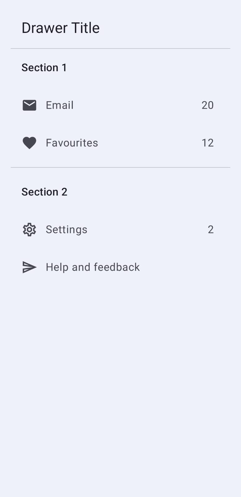
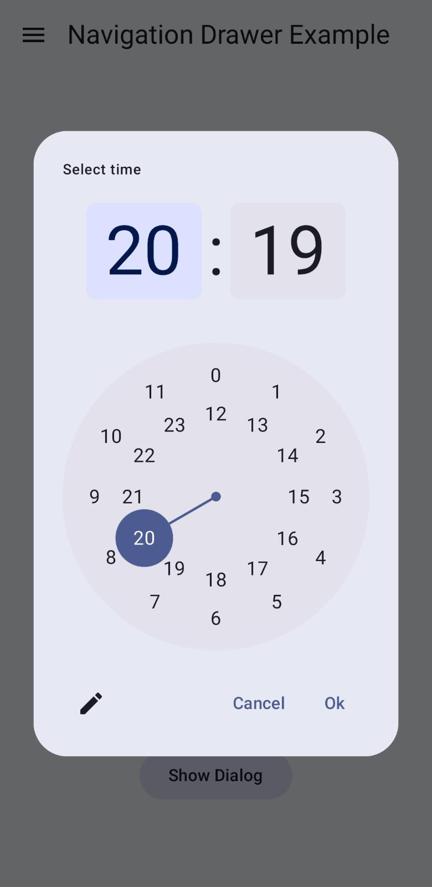
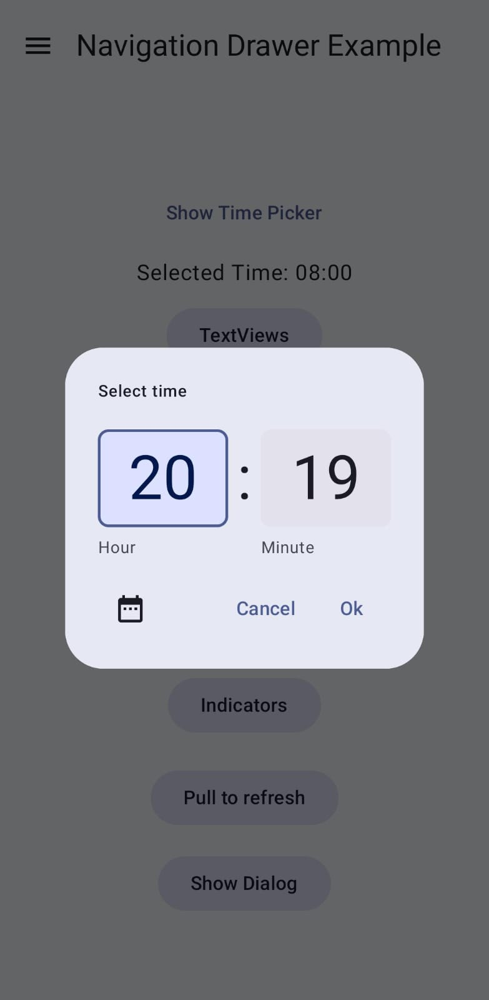
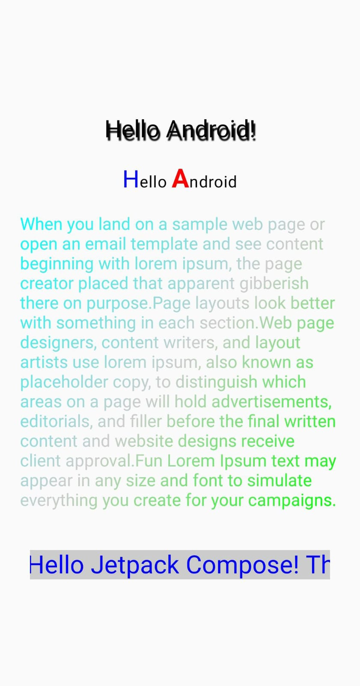
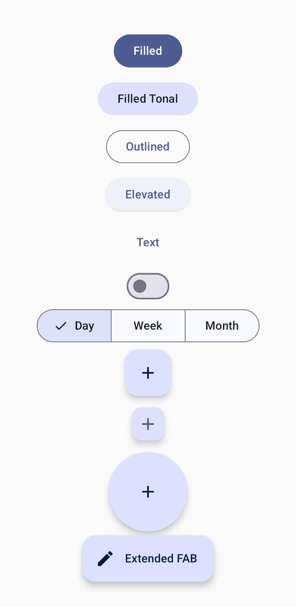
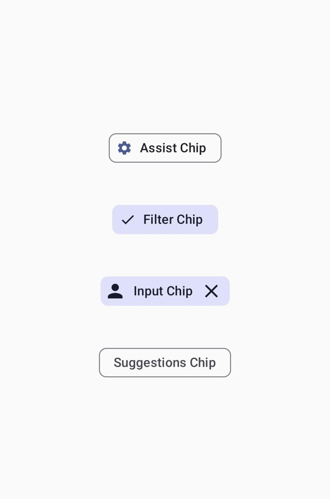
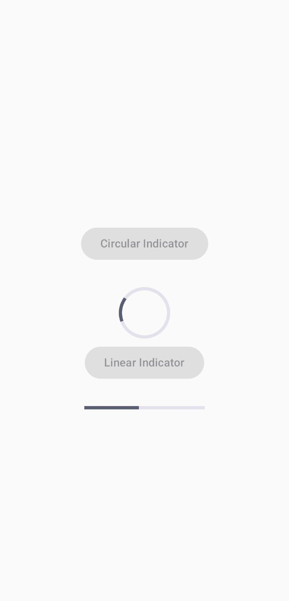
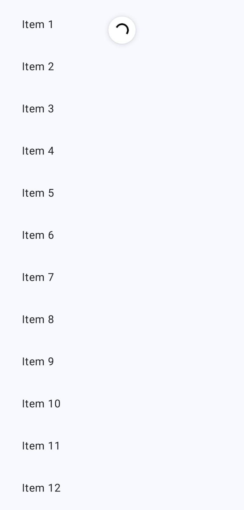
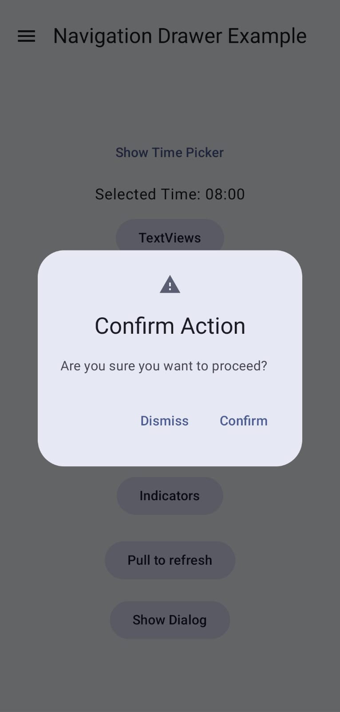

<h1 align="center">Material Design UI Components</h1>

  
  
  

✨ Features

FeatureDescription🎨 Material Design 3Latest Material Design components and styling📱 NavigationModal drawer with custom sections⏰ Time SelectionInteractive time picker with dual modes🔘 ButtonsComplete collection of Material button types🎴 CardsVarious card styles and implementations🏷️ ChipsInteractive chip components📊 ProgressLinear and circular indicators

🛠️ Components

Navigation Components

Modal Navigation Drawer
Custom Drawer Sections
Top App Bar Integration

Time Selection

Interactive Time Picker
Dial/Input Mode Toggle
24-hour Format Support

Button Collection

Filled Buttons
Outlined Buttons
Text Buttons
Tonal Buttons
Elevated Buttons
Floating Action Buttons

📥 Installation

Add the dependencies to your project:

gradleCopydependencies {
    implementation 'androidx.activity:activity-compose:1.8.2'
    implementation 'androidx.compose.material3:material3:1.1.2'
    implementation 'androidx.compose.ui:ui:1.5.4'
}

Clone the repository:

bashCopygit clone https://github.com/yourusername/material-design-components.git

 
🌟 Screenshots

  
  
  

  
  
  

  
  
  

  

